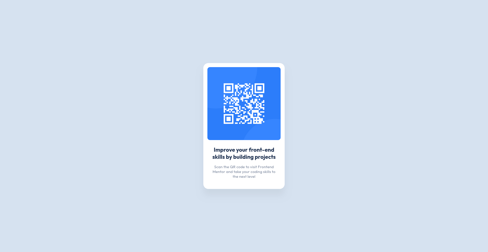

# QR Code Component

Simple design QR Code Component, Challenge by [frontend-mentor](https://www.frontendmentor.io/challenges/qr-code-component-iux_sIO_H)



The app build with `webpack`, `sass`

coded by [Abdel-Rahman](https://github.com/abdelrahman-mh)

## Usage

all main files in `/src/` dire

- Start the dev server:

  ```shell
    npm start
  ```

  this will start the dev server at [http://localhost:3000](http://localhost:3000/)

- Build to Production:

  ```shell
    npm run build
  ```

  Will build the project in `/dist/` dire, Will build a static Html page

- Deploy to GitHub Pages:
  ```shell
    npm run deploy
  ```
  This will deploy the latest changes to github pages host

## Links

[Website](https://abdelrahman-mh.github.io/qr-code-component/)
